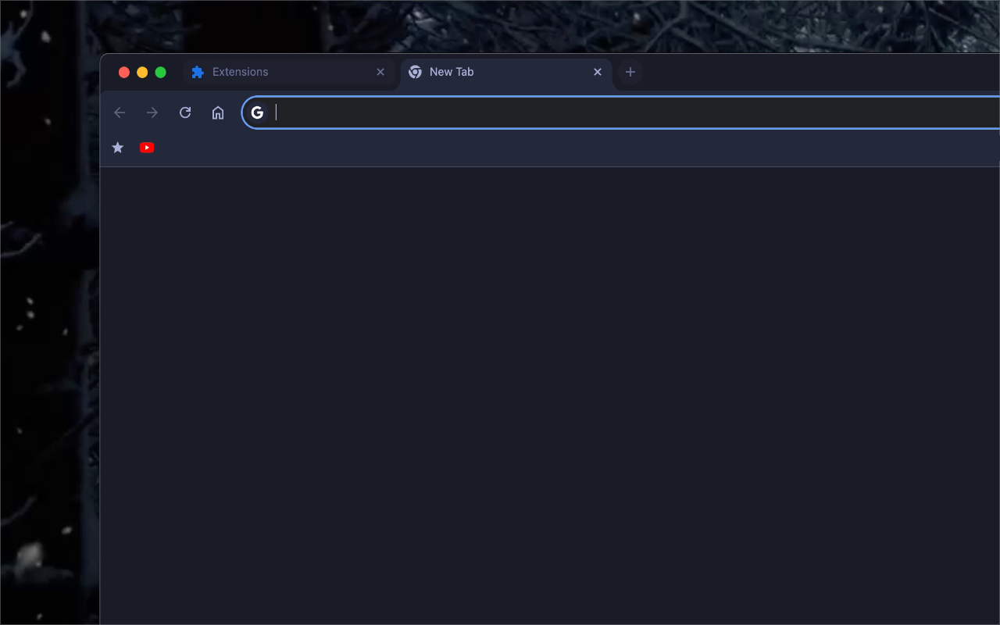

# Tokyo Night Storm Theme

<p align="center">

</p>

**Version 1.0.0**

An elegant dark theme inspired by Tokyo's night storms. Features soothing blues and purples for a calming browsing experience.

## Chrome Web Store

[Download from Chrome Web Store](https://chromewebstore.google.com/detail/tokyo-night-storm-theme/pgbjifpikialeahbdendkjioeafbmfkn)

## Make your environment Tokyo Night

- **nvim** : https://github.com/folke/tokyonight.nvim
- **tmux** : https://github.com/janoamaral/tokyo-night-tmux
- **Alacritty** : https://github.com/LockeAG/dotfiles-public/blob/main/.alacritty/themes/tokyo-nights-storm.toml
- **Slack**:
- System Navigation:`#2840A9`
- Selected Items:`#7D95EB`
- Presence indication: `#3651C0`
- Notificatons: `#2840A9`
- **VSCode**: https://marketplace.visualstudio.com/items?itemName=enkia.tokyo-night
- **Zed** : https://github.com/ssaunderss/zed-tokyo-night/
- **Obsidian** : https://github.com/arozx/obsidian_tokyo-night-storm

## Features

- **Dark and Elegant Design**: Inspired by Tokyo's neon-lit nights and stormy ambiance.
- **Soothing Colors**: Blues and purples create a calming effect while browsing.
- **Custom Icons**: Beautiful icons designed to fit the theme's aesthetic.

## Installation

1. **Clone the Repository**:
   ```bash
   git clone https://github.com/LockeAG/tokyo-nights-storm-chrome.git
   ```
2. **Navigate to the Directory**:

   ```bash
   cd tokyo-nights-storm-chrome
   ```

3. **Load the Theme in Chrome:**
   - Open Chrome and navigate to `chrome://extensions/`.
   - Enable `Developer mode` in the top right corner.
   - Click `Load unpacked` and select the `tokyo-nights-storm-chrome` directory.

## Screenshots




## Contributing

If you would like to contribute to this project, please open an issue or submit a pull request. All contributions are welcome!

## License

This project is licensed under the MIT License - see the [LICENSE](LICENSE) file for details.
